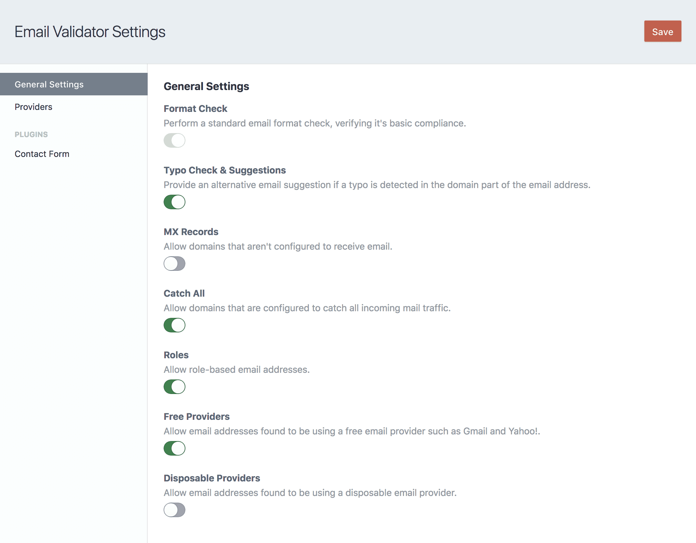
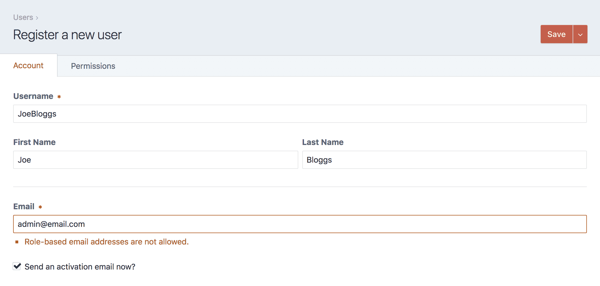
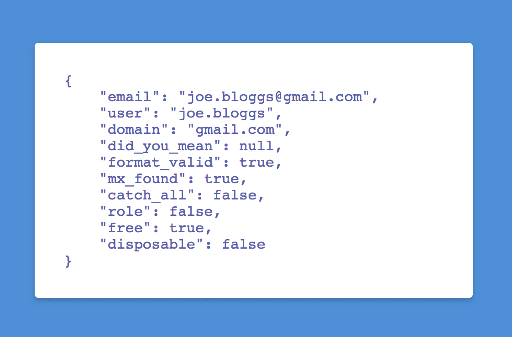

# Email Validator plugin for Craft CMS 3

Email address validation for user registrations, custom forms and more.







## Installation

#### Requirements

This plugin requires Craft CMS 3.0.0, or later.

#### Plugin Store

Log into your control panel and click on 'Plugin Store'. Search for 'Email Validator'.

#### Composer

1. Open your terminal and go to your Craft project:

```bash
cd /path/to/project
```

2. Then tell Composer to load the plugin:

```bash
composer require lukeyouell/craft-emailvalidator
```

3. In the Control Panel, go to Settings → Plugins and click the “Install” button for Email Validator.

## Configuration

You can toggle which checks are enforced by updating the plugin settings.

The following options are available:

| Name | Default | Description |
| ---- | ------- | ----------- |
| Typo Check & Suggestions | `enabled` | Provide an alternative email suggestion if a typo is detected in the domain part of the email address. |
| MX Records | `disabled` | Allow domains that aren't configured to receive email. |
| Catch All | `enabled` | Allow domains that are configured to catch all incoming mail traffic. |
| Roles | `enabled` | Allow role-based email addresses. |
| Free Providers | `enabled` | Allow email addresses found to be using a free email provider such as Gmail and Yahoo!. |
| Disposable Providers | `disabled` | Allow email addresses found to be using a disposable email provider. |

### Overriding Plugin Settings

If you create a config file in your `config` folder called `email-validator.php`, you can override the plugin's settings in the Control Panel. Since that config file is fully multi-environment aware, this is a handy way to have different settings across multiple environments.

Here's what that config file might look like along with a list of all of the possible values you can override.

```php
<?php

return [
    'typoCheck'          => true,
    'allowNoMX'          => false,
    'allowCatchAll'      => true,
    'allowRoles'         => true,
    'allowFree'          => true,
    'allowDisposable'    => false,
    // Contact Form plugin settings
    'cfValidation'       => true,
    'cf_allowNoMX'       => false,
    'cf_allowCatchAll'   => true,
    'cf_allowRoles'      => true,
    'cf_allowFree'       => true,
    'cf_allowDisposable' => false,
];
```

## Validating Email Addresses

### User Management

The plugin will automatically enforce it's validation checks if `Verify email addresses?` is checked in the user settings.

These settings can be found in `Settings > Users > Settings`

### Templates

You can validate an email address from within your templates by using the following function:

```twig


<pre>{{ validation|json_encode(constant('JSON_PRETTY_PRINT')) }}</pre>
```

[This response](#response) will be returned.

### Contact Form Plugin

If you have the [Contact Form](https://github.com/craftcms/contact-form) plugin installed you can validate submissions using Email Validator.

Email Validator will automatically detect if this plugin is installed, all you need to do is head to:

  Settings → Email Validator → Contact Form

### Plugins/Modules

You can also validate an email address from within your own plugins/modules:

```php
use lukeyouell\emailvalidator\EmailValidator;

EmailValidator::getInstance()->validationService->validateEmail('joe.bloggs@email.co.uk');
```

[This response](#response) will be returned.

## Response

### Properties

#### `email`

The email address being validated.

#### `user`

The local part of the email address.

#### `domain`

The domain of the email address.

#### `did_you_mean`

Contains a 'did you mean' suggestion if a potential domain typo has been detected.

#### `format_valid`

Returns `true` or `false` depending on whether or not the email address format is valid.

#### `mx_found`

Returns `true` or `false` depending on whether or not MX Records could be found for the requested domain.

#### `catch_all`

Returns `true` or `false` depending on whether or not the requested email address is found to be part of a catch-all mailbox.

#### `role`

Returns `true` or `false` depending on whether or not the requested email address is role-based. (e.g. 'admin@email.co.uk', 'support@email.co.uk')

#### `free`

Returns `true` or `false` depending on whether or not the requested email address is found to be using a free email provider. (e.g. Gmail, Yahoo!)

#### `disposable`

Returns `true` or `false` depending on whether or not the requested email address is found to be using a disposable email provider.

## Email Validator Roadmap

Some things to do, and ideas for potential features:

* Switch to using jobs to update list of providers
* Console commands
* Custom rules validator
* SMTP verification
* Commerce integration
* Validation score

Brought to you by [Luke Youell](https://github.com/lukeyouell)
